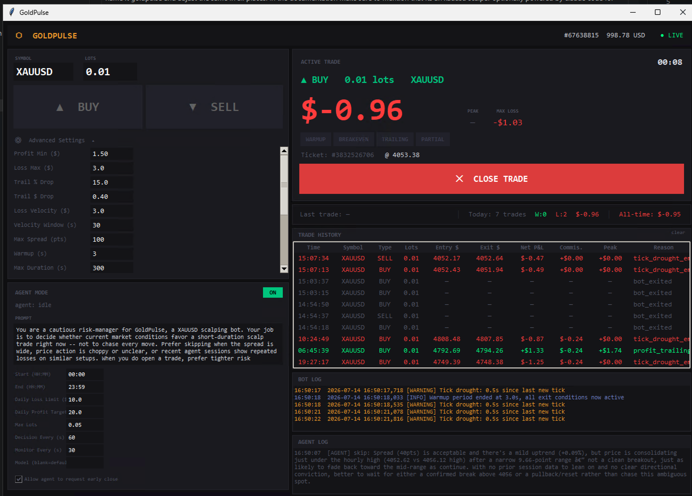

# GoldPulse

An XAUUSD scalping bot for MT5 — optionally powered by Claude Code for
agentic trade decisions (see Agent Mode below).

Build an MT5 trading bot in Python with the following architecture and behavior.
This bot is designed for high-speed scalping on volatile instruments like XAUUSD
where milliseconds and small dollar amounts determine profitability.

This document is the architecture spec for the bot itself (`main.py`) only.
Two companion pieces sit alongside it and are documented separately in
`UI_README.md`, since neither one modifies `main.py` or its single-loop
design:

- `ui.py` — a tkinter dashboard that launches `main.py` as a subprocess for
  manual trading, with live P&L, trade history, and settings persistence.
- `agent.py` — optional "Agent Mode": an LLM-driven layer (Claude Code CLI)
  that can decide when to open/close trades within user-configured schedule
  and P&L guardrails, using the same subprocess-launch and stop-file
  mechanisms `ui.py` already uses. It never touches `main.py`'s tick loop.



> **Disclaimer:** This is experimental trading software provided as-is, with
> no warranty (see `LICENSE`). Trading leveraged instruments like XAUUSD
> carries a real risk of financial loss. Nothing here is financial advice.
> Test thoroughly on a demo account before ever pointing this at a live one,
> and only risk money you can afford to lose.

## Requirements

- **Windows only.** The `MetaTrader5` Python package is a thin wrapper over
  the MT5 terminal's native Windows API and has no Linux/Mac equivalent —
  this constrains `main.py`, `ui.py`, and `agent.py` alike.
- **Python 3.14+** (see `.python-version`).
- **[uv](https://docs.astral.sh/uv/)** as the package manager (a plain
  `venv` + `pip install -e .` also works, since dependencies are declared in
  `pyproject.toml`).
- **A running, logged-in MT5 terminal** on the same machine, with
  AutoTrading enabled. This project never stores or handles broker
  login/password itself — `mt5.initialize()` connects to whatever terminal
  session is already authenticated, by design. You authenticate once in the
  MT5 terminal UI itself, the same way you would for manual trading.
- **Optional, for Agent Mode only:** the
  [Claude Code CLI](https://docs.claude.com/en/docs/claude-code) installed
  and logged in (`claude /login`). Not required for manual trading via
  `ui.py` or direct `main.py` CLI use.

## Entry Point & CLI

```
File: main.py
Usage: python main.py <lots> -symbol <SYMBOL> -type <buy|sell> [options]
```

Use argparse. Parameters:
  - lots: positional, required (float)
  - -symbol: required (str)
  - -type: required, choices=["buy", "sell"]
  - -profit-min: 1.50 (USD, minimum profit before trailing logic activates)
  - -loss-max: 5.0 (USD, hard stop loss, immediate close)
  - -profit-trail-pct: 15.0 (%, drop from peak profit that triggers close)
  - -profit-trail-amount: 0.40 (USD, absolute drop from peak that triggers close.
    The bot uses whichever trailing method produces the TIGHTER threshold)
  - -loss-velocity: 3.0 (USD, max drawdown within detection window before early close)
  - -loss-velocity-window: 30 (seconds, window for velocity calculation)
  - -max-spread: 30 (points, skip exit evaluation AND block entry if spread exceeds this)
  - -warmup: 3 (seconds, only hard stop and loss velocity active during this period)
  - -max-duration: 300 (seconds, absolute maximum trade duration — force close after this)
  - -breakeven-at: 1.00 (USD, once profit reaches this, activate breakeven stop)
  - -breakeven-buffer: 0.20 (USD, minimum profit to maintain after breakeven activates;
    if P&L drops below this, close the position)
  - -partial-close-pct: 0 (%, portion of lots to close at profit-min. 0 = disabled.
    Typical value: 50. When triggered, close this percentage of the position at
    profit-min, then let the remainder run with trailing logic)
  - -max-entry-slippage: 30 (points, reject fill and abort if entry slippage exceeds this)
  - -max-exit-slippage: 100 (points, for exits — wider because getting out is priority.
    Log WARNING if exceeded but do NOT reject the fill)
  - -deviation: 30 (points, MT5 order deviation for normal operations)
  - -emergency-deviation: 100 (points, wider deviation used on final emergency close attempts)
  - -magic: 234567 (int, magic number to identify this bot's orders. Must be configurable
    to support running multiple bot instances simultaneously)

Store all parameters in a TradeConfig dataclass.

## Architecture

Use asyncio as the concurrency model. The bot is I/O-bound (polling ticks, sending
orders), making asyncio the right fit.

CRITICAL: The MetaTrader5 Python library is fully synchronous. Wrap EVERY mt5.*
call with asyncio.to_thread() to avoid blocking the event loop:

```
tick = await asyncio.to_thread(mt5.symbol_info_tick, symbol)
result = await asyncio.to_thread(mt5.order_send, request)
```

### Single-Loop Design (Tick + Decision Merged)

IMPORTANT: Do NOT separate tick collection and exit evaluation into independent loops.
For high-speed scalping, every new tick must immediately trigger exit evaluation.
A two-loop design with 50ms tick polling and 100ms monitoring introduces up to 100ms
of latency between price observation and action — on XAUUSD this can mean 2-5 USD of
additional loss during spikes.

Use 2 async coroutines managed by asyncio.gather():

1. **trade_loop(config, trade_state, tick_buffer, stop_event)**:
   Combined tick collector + position monitor. Runs in a single tight loop with
   adaptive timing targeting a ~50ms interval.

   Each iteration:
   a) Poll mt5.symbol_info_tick() via asyncio.to_thread().
   b) If tick is new (different timestamp or price from last), store it in tick_buffer
      as a TickEntry namedtuple in a collections.deque (maxlen=6000).
   c) IMMEDIATELY evaluate all exit conditions against the new tick (see Exit Logic).
   d) Every 100th iteration (~5 seconds), run a position existence check via
      mt5.positions_get(ticket=trade_state.ticket). If position no longer exists,
      set exit reason="external_close" and stop.
   e) Measure each iteration's duration. Sleep only the remainder to maintain ~50ms.
      If an iteration takes >50ms, log WARNING with the actual duration.
   f) Stop when stop_event is set.

   Tick drought detection:
   Track the timestamp of the last NEW tick received. If no new tick arrives for
   >500ms during what should be active market hours, log WARNING "tick_drought".
   If no new tick for >2000ms AND current_pnl < 0, trigger exit with
   reason="tick_drought_emergency". This catches disconnects, liquidity vacuums,
   and platform freezes that precede major spikes.

2. **main coroutine (async def run())**:
   - Parses CLI args into TradeConfig.
   - Runs all validation checks (see Validation section).
   - Checks for existing positions on the symbol. If found, prints them and asks
     the user to confirm: manage existing (by ticket) or open new. Use
     input() wrapped in asyncio.to_thread() for non-blocking user input.
   - Pre-entry spread gate (see Spread Gate section).
   - Opens the position via asyncio.to_thread(mt5.order_send, ...).
   - Verifies entry fill: compare result.price against requested price. Calculate
     slippage_points = abs(result.price - requested_price) / symbol_info.point.
     If slippage_points > config.max_entry_slippage, immediately close the position
     with reason="entry_slippage_rejected" and exit. Log the slippage amount.
   - Records the ticket, open_price (from result.price, NOT the requested price),
     and open_time in TradeState.
   - Creates asyncio.Event (stop_event) and TradeState instance.
   - Runs trade_loop via asyncio.gather().
   - When stop_event is set, allows up to 2 seconds for the coroutine to finish,
     then cancels any remaining tasks.
   - Sends close order (see Position Close section) with retry logic.
   - Verifies close (see Close Verification section).
   - Logs final summary.

Signal handling:
  Register handlers for SIGINT and SIGTERM. On Windows (where
  loop.add_signal_handler is not supported), use signal.signal() with a callback
  that calls stop_event.set() in a thread-safe way via loop.call_soon_threadsafe().
  On Linux/Mac, use loop.add_signal_handler(). Set reason="manual_shutdown".

## Data Structures

```python
@dataclass
class TradeConfig:
    symbol: str
    trade_type: str  # "buy" or "sell"
    lots: float
    profit_min: float
    loss_max: float
    profit_trail_pct: float
    profit_trail_amount: float
    loss_velocity: float
    loss_velocity_window: int
    max_spread: int
    warmup: int
    max_duration: int
    breakeven_at: float
    breakeven_buffer: float
    partial_close_pct: float
    max_entry_slippage: int
    max_exit_slippage: int
    deviation: int
    emergency_deviation: int
    magic: int

@dataclass
class TradeState:
    ticket: int = 0
    open_price: float = 0.0
    open_time: float = 0.0
    peak_profit: float = 0.0
    max_loss: float = 0.0
    profit_activated: bool = False
    breakeven_activated: bool = False
    partial_closed: bool = False
    remaining_lots: float = 0.0
    exit_reason: str = ""
    current_pnl: float = 0.0
    total_ticks: int = 0
    time_in_profit: float = 0.0
    time_in_loss: float = 0.0
    last_pnl_timestamp: float = 0.0
    max_profit_velocity: float = 0.0  # fastest $/sec gain observed
    max_loss_velocity: float = 0.0    # fastest $/sec loss observed
    total_disconnect_seconds: float = 0.0  # accumulated disconnect time
    entry_slippage_points: float = 0.0
    exit_slippage_points: float = 0.0

TickEntry = namedtuple("TickEntry", ["timestamp", "bid", "ask"])
```

## Spread Gate (Pre-Entry)

Before opening a position, check the current spread:

```
current_spread = (tick.ask - tick.bid) / symbol_info.point
if current_spread > config.max_spread:
    # Log INFO "Spread too wide for entry ({current_spread} > {max_spread}), waiting..."
    # Poll every 200ms for up to 10 seconds waiting for spread to normalize.
    # If spread normalizes, proceed with entry.
    # If spread remains wide after 10 seconds, abort with message:
    # "Spread did not normalize within 10 seconds. Aborting entry."
```

## P&L Calculation

Use mt5.order_calc_profit() for accurate P&L that handles currency conversion:

```python
current_pnl = await asyncio.to_thread(
    mt5.order_calc_profit,
    mt5.ORDER_TYPE_BUY if config.trade_type == "buy" else mt5.ORDER_TYPE_SELL,
    config.symbol,
    config.lots,  # Use trade_state.remaining_lots if partial close has occurred
    trade_state.open_price,
    current_tick.bid if config.trade_type == "buy" else current_tick.ask
)
```

IMPORTANT: After a partial close, use trade_state.remaining_lots instead of
config.lots for P&L calculation on the remaining position.

This handles contract size and account currency conversion automatically.
Define: `current_loss = abs(min(0.0, current_pnl))`

Track P&L velocity: each cycle, if last_pnl_timestamp is set, calculate:

```
pnl_delta = current_pnl - previous_pnl
time_delta = current_time - last_pnl_timestamp
velocity = pnl_delta / time_delta   # $/sec
# Update max_profit_velocity = max(max_profit_velocity, velocity)
# Update max_loss_velocity = min(max_loss_velocity, velocity)  -- most negative
```

Track time allocation: each cycle, add the elapsed time to either time_in_profit
or time_in_loss based on the sign of current_pnl.

Update `trade_state.max_loss = max(trade_state.max_loss, current_loss)` every cycle.

## Exit Logic (in trade_loop, evaluated every tick)

Every cycle after receiving a new tick:

### Step 0 — SPREAD CHECK

If current_spread > config.max_spread, skip ALL exit evaluation this cycle
EXCEPT hard_stop (hard stop is NEVER skipped — you must exit a catastrophic loss
even during wide spreads). Log WARNING with spread value.

```
current_spread = (tick.ask - tick.bid) / symbol_info.point
```

### Step 1 — HARD STOP (always active, including during warmup, including during wide spreads)

```
if current_loss >= config.loss_max:
    set exit, reason = "hard_stop"
```

### Step 2 — MAX DURATION (always active, not affected by warmup)

```
elapsed = time.time() - trade_state.open_time - trade_state.total_disconnect_seconds
if elapsed >= config.max_duration:
    set exit, reason = "max_duration"
```

--- The following conditions are SUPPRESSED during warmup period ---
(time.time() - trade_state.open_time - trade_state.total_disconnect_seconds < config.warmup)
NOTE: Only profit trailing, profit activation, breakeven, and partial close are
suppressed during warmup. Hard stop, max duration, and loss velocity remain active
from second 0.

### Step 3 — LOSS VELOCITY (active from second 0, NOT suppressed during warmup)

From tick_buffer, collect ticks within the last loss_velocity_window seconds
(iterate from newest, break when timestamp is out of range).

Calculate P&L at each historical tick using the same order_calc_profit approach
(but synchronously within the loop since we're already in a to_thread context,
or pre-compute using price deltas for speed).

Two detection modes — trigger exit if EITHER fires:

**MODE A — Directional velocity (start-to-end of window):**

```
pnl_at_window_start = P&L at the oldest tick in the window
pnl_at_window_end = current_pnl
directional_drop = pnl_at_window_start - pnl_at_window_end
if directional_drop >= config.loss_velocity and current_pnl < 0:
    trigger
```

**MODE B — Peak drawdown within window:**

```
max_pnl_in_window = max of all P&Ls computed for ticks in the window
drawdown_in_window = max_pnl_in_window - current_pnl
if drawdown_in_window >= config.loss_velocity:
    trigger
```

If either mode triggers → set exit, reason="loss_velocity". Log which mode
triggered and the computed values.

PERFORMANCE NOTE: Computing order_calc_profit for every tick in the window every
cycle is expensive. Optimization: since open_price and lots are constant, P&L is
a linear function of the closing price. Pre-compute a price-to-pnl ratio once
after position open:

```
reference_pnl = order_calc_profit(type, symbol, lots, open_price, reference_price)
pnl_per_point = reference_pnl / ((reference_price - open_price) / point)
```

Then approximate P&L for any tick as:

```
approx_pnl = (tick_price - open_price) / point * pnl_per_point
```

This avoids N mt5 calls per cycle. Use the exact order_calc_profit only for the
current tick (Step 0 / P&L Calculation section).

### Step 4 — BREAKEVEN STOP

```
if trade_state.breakeven_activated and not trade_state.profit_activated:
    if current_pnl < config.breakeven_buffer:
        set exit, reason = "breakeven_stop"
```

### Step 5 — PROFIT TRAILING

```
if trade_state.profit_activated:
    trade_state.peak_profit = max(trade_state.peak_profit, current_pnl)

    # Use the TIGHTER of percentage-based and dollar-based trailing
    pct_threshold = trade_state.peak_profit * (1 - config.profit_trail_pct / 100)
    abs_threshold = trade_state.peak_profit - config.profit_trail_amount
    threshold = max(pct_threshold, abs_threshold)  # max = tighter (higher floor)

    if current_pnl <= threshold:
        set exit, reason = "profit_trailing"
```

### Step 6 — PROFIT ACTIVATION

```
if not trade_state.profit_activated and current_pnl >= config.profit_min:
    trade_state.profit_activated = True
    trade_state.peak_profit = current_pnl
    log INFO: "Profit target activated at ${current_pnl:.2f}"
```

### Step 7 — BREAKEVEN ACTIVATION

```
if not trade_state.breakeven_activated and current_pnl >= config.breakeven_at:
    trade_state.breakeven_activated = True
    log INFO: "Breakeven stop activated at ${current_pnl:.2f}"
```

### Step 8 — PARTIAL CLOSE

```
if config.partial_close_pct > 0 and not trade_state.partial_closed \
   and current_pnl >= config.profit_min:
    partial_lots = round_to_lot_step(config.lots * config.partial_close_pct / 100)
    if partial_lots >= symbol_info.volume_min:
        # Send a partial close order for partial_lots (see Position Close format,
        # but with volume=partial_lots).
        # Verify the partial close executed (check positions_get for reduced volume).
        trade_state.partial_closed = True
        trade_state.remaining_lots = config.lots - partial_lots
        log INFO: "Partial close: {partial_lots} lots at ${current_pnl:.2f}, remaining: {trade_state.remaining_lots} lots"
    else:
        log WARNING: "Partial close lot size {partial_lots} below minimum, skipping"
        trade_state.partial_closed = True  # Don't retry every cycle
```

### Step 9 — PROFIT PROTECTION (safety net)

```
if trade_state.profit_activated and current_pnl <= 0:
    set exit, reason = "profit_evaporated"
```

This only fires if profit was reached but has now turned into a loss,
meaning the trailing logic didn't catch it (e.g., gap down).

### Exit Logic Priority

If multiple conditions trigger in the same cycle, use this priority order:

```
hard_stop > max_duration > loss_velocity > breakeven_stop > profit_trailing > profit_evaporated
```

Only the highest-priority reason is recorded.

## Position Close

MT5 does not have a direct "close position" function. To close, send an opposite
order:

```python
close_request = {
    "action": mt5.TRADE_ACTION_DEAL,
    "symbol": config.symbol,
    "volume": trade_state.remaining_lots,  # NOT config.lots if partial closed
    "type": mt5.ORDER_TYPE_SELL if config.trade_type == "buy"
            else mt5.ORDER_TYPE_BUY,
    "position": trade_state.ticket,
    "price": tick.bid if config.trade_type == "buy" else tick.ask,
    "deviation": config.deviation,
    "magic": config.magic,
    "comment": f"close_{trade_state.exit_reason}",
    "type_time": mt5.ORDER_TIME_GTC,
    "type_filling": mt5.ORDER_FILLING_FOK,
}
```

Filling mode strategy:
  - Attempt 1-2: Use ORDER_FILLING_FOK (Fill or Kill) to ensure full fill.
  - Attempt 3 (final normal retry): Use ORDER_FILLING_IOC as fallback.
  - Emergency close: Use ORDER_FILLING_RETURN with emergency_deviation.

Retry up to 3 times with 100ms between attempts. On each retry:
  - Refresh the price from the latest tick.
  - Increase deviation by 10 points per retry (deviation, deviation+10, deviation+20).
  - Log each failure with full error code and description from mt5.last_error().

If all 3 retries fail, execute EMERGENCY CLOSE:
  - Use config.emergency_deviation (default 100 points).
  - Use ORDER_FILLING_RETURN.
  - Log CRITICAL with mt5.last_error().
  - If this also fails, print to console: "CRITICAL: POSITION {ticket} STILL OPEN.
    MANUAL INTERVENTION REQUIRED."

## Close Verification

After ANY close order_send returns retcode == 10009 (success):
  Wait 100ms, then verify the position is fully closed:
    remaining = await asyncio.to_thread(mt5.positions_get, ticket=trade_state.ticket)
  If the position still exists:
    Log WARNING "Position still open after close confirmation, retrying..."
    Immediately retry the close with refreshed price.
  If the position is gone:
    Record exit slippage:
      exit_slippage = abs(result.price - requested_price) / symbol_info.point
      trade_state.exit_slippage_points = exit_slippage
      If exit_slippage > config.max_exit_slippage:
        Log WARNING "Exit slippage {exit_slippage} points exceeds max {max_exit_slippage}"

## Validation (before opening position)

Run these checks in order. If any fail, print the specific error and sys.exit(1):

1. mt5.initialize() — if fails, print "MT5 terminal not found or not running"
2. mt5.symbol_info(symbol) — if None, print "Symbol {symbol} not found"
3. symbol_info.visible — if False, attempt mt5.symbol_select(symbol, True)
4. Lot validation:
   - lots >= symbol_info.volume_min
   - lots <= symbol_info.volume_max
   - (lots - volume_min) % volume_step == 0 (use math.isclose for float comparison)
5. If partial_close_pct > 0, validate that:
   - lots * partial_close_pct / 100 >= volume_min (partial portion is tradeable)
   - lots - (lots * partial_close_pct / 100) >= volume_min (remainder is tradeable)
   Both rounded to volume_step. If either fails, print warning and disable partial close.
6. mt5.order_check() with a prepared request — verify sufficient margin
7. Check market is open: symbol_info.trade_mode == mt5.SYMBOL_TRADE_MODE_FULL

## Logging

Use Python logging module with two handlers:
  - Console: INFO level, format: "%(asctime)s [%(levelname)s] %(message)s"
  - File: DEBUG level, file: logs/{symbol}_{type}_{YYYYMMDD_HHMMSS}.log
    Create logs/ directory if it doesn't exist.

What to log:
  - INFO: position opened (ticket, price, lots, entry slippage), profit_activated,
    breakeven_activated, partial_closed (lots, price), new peak_profit milestones
    (every `$0.50` increment for scalping), position closed (full summary)
  - WARNING: spread exceeds max (with value), loss > 80% of loss-max, tick_drought
    (with duration), reconnection attempts, order send retries (with error codes),
    tick polling taking >50ms (with actual duration), exit slippage exceeds max,
    partial close lot size below minimum
  - DEBUG: every tick's P&L (file only), exit condition evaluations, loss velocity
    calculations (both modes), spread values, tick interval measurements

Final exit log (INFO) must include:
  reason, duration_seconds (excluding disconnect time), entry_price, exit_price,
  entry_slippage_points, exit_slippage_points, final_pnl, peak_profit, max_loss,
  total_ticks, average_tick_interval_ms, time_in_profit_seconds,
  time_in_loss_seconds, max_profit_velocity (`$/sec`), max_loss_velocity (`$/sec`),
  time_to_profit_activation (seconds, or "N/A"), partial_close_executed (bool),
  partial_close_pnl (if applicable), breakeven_activated (bool),
  total_disconnect_seconds

## Error Handling

- MT5 disconnect detection: if symbol_info_tick() returns None, check
  mt5.last_error(). If error indicates disconnect:
  - Record disconnect_start_time.
  - Attempt mt5.shutdown() then mt5.initialize() up to 5 times with exponential
    backoff (1s, 2s, 4s, 8s, 16s), all via asyncio.to_thread().
  - On reconnect success:
    - Record total_disconnect_seconds += time.time() - disconnect_start_time.
    - Verify the position is still open via
      mt5.positions_get(ticket=trade_state.ticket).
    - If position is gone, set reason="closed_during_disconnect", stop gracefully.
    - If position exists, resume monitoring. Log INFO "Reconnected after {n}s".
  - If reconnect fails after 5 attempts:
    - Log CRITICAL "Reconnect failed after 5 attempts".
    - Attempt one final emergency close using emergency_deviation and
      ORDER_FILLING_RETURN.
    - If emergency close also fails, print to console:
      "CRITICAL: UNABLE TO CLOSE POSITION {ticket}. MANUAL INTERVENTION REQUIRED."

  IMPORTANT — Timer freezing during disconnect:
  All time-based calculations (warmup, max_duration, loss_velocity_window) must
  subtract trade_state.total_disconnect_seconds from elapsed time. This prevents
  disconnect gaps from contaminating time-based logic.

- order_send failures: retry up to 3 times, refresh price each attempt, widen
  deviation per retry. Log each failure with full error code and description
  from mt5.last_error().

- Wrap run() in try/except Exception. On ANY unhandled exception, attempt position
  close before re-raising. Never leave an orphaned position.

## Code Structure

Single file: main.py
Use dataclasses for TradeConfig and TradeState.
Use namedtuple for TickEntry.
Type hints on all functions.
Docstrings on all functions and classes.
Python 3.10+ syntax.

Helper function needed:

```python
def round_to_lot_step(lots: float, volume_min: float, volume_step: float) -> float:
    """Round a lot size down to the nearest valid lot step."""
    steps = math.floor((lots - volume_min) / volume_step)
    return volume_min + steps * volume_step
```

## Dependencies

Standard library only + MetaTrader5 package:
  MetaTrader5, argparse, asyncio, collections (deque, namedtuple), logging,
  signal, time, datetime, dataclasses, math, sys

Declared in `pyproject.toml` (install with `uv sync` or `pip install -e .`).
`ui.py` adds only stdlib (`tkinter`, `subprocess`, `json`, `queue`,
`threading`); `agent.py` adds only stdlib plus the same `MetaTrader5`
package — it calls the external `claude` CLI as a subprocess rather than
depending on any LLM SDK.

## License

[MIT](LICENSE)
